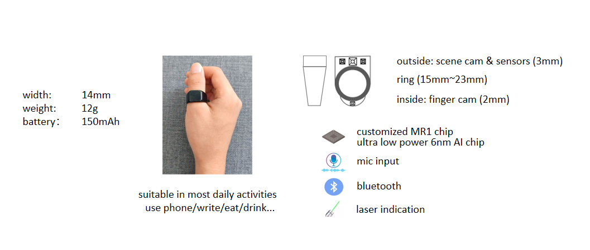
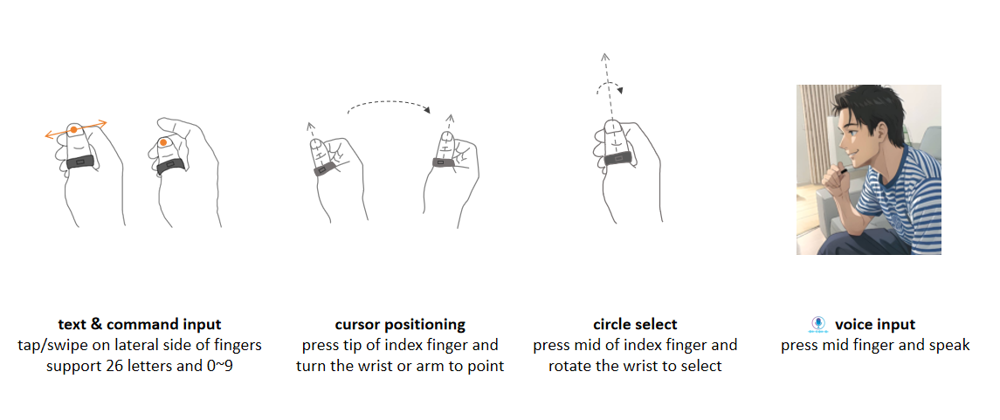
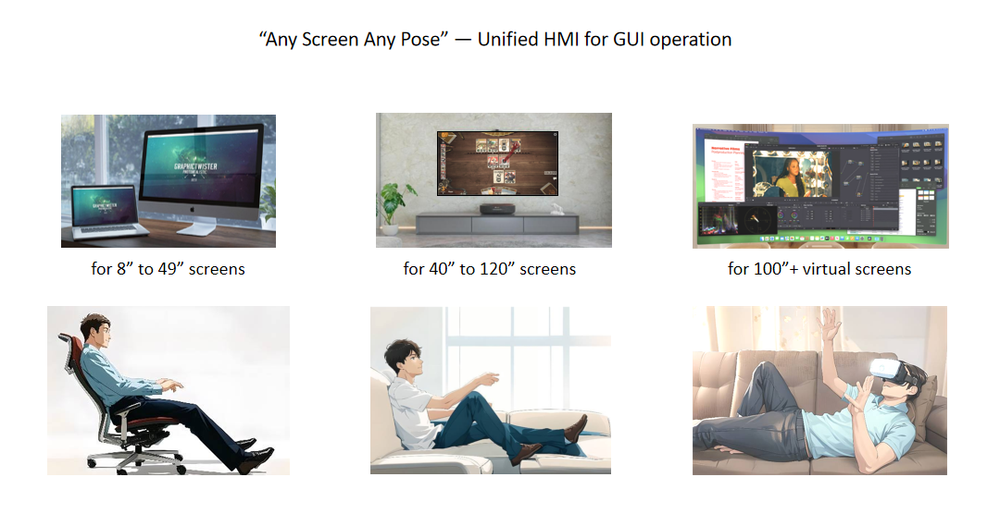
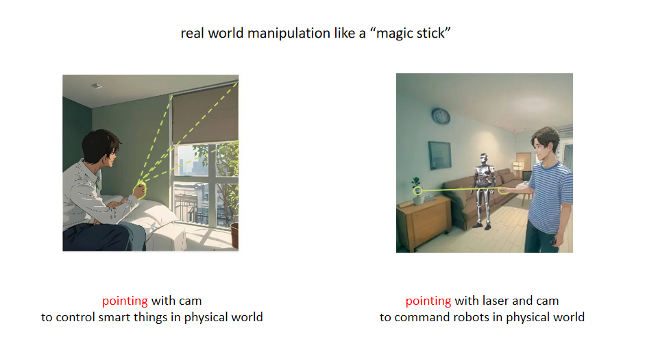
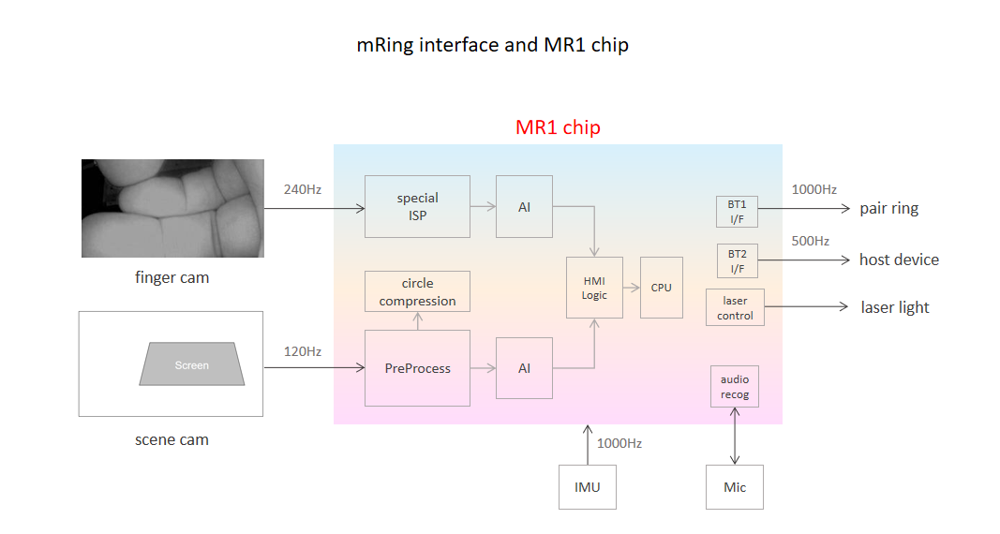

**mRing**: wearable multimodal smart Ring for HCI.

A thumb-worn smart ring, callled "mRing", is designed to support multimodal interactions with computers/TV/AI. Users can use it to replace mouse&keyboard or remoter, extend human-computer interaction beyond screens, and enable intuitive manipulation of robots and smart home systems.

---

## 🌟 Why mRing?

### The personal motivation  
My teenage son plays PC games like HOI4 and Cards for hours every day, and also watches game related videos to improve gaming performance.  
Seeing him develop early symptoms of wrist stress and other issue forced me to rethink the input devices we all still rely on.

**Why are we still using mouse and keyboard — technologies invented 40 years ago — in a world with AI computing, multimodal input and versatile screens, and intelligent agents?**

This question led me to create **mRing**, an input device that compliants to GUI operation on PC/TV/Pad and aligns with the next decade of AI-native interaction.

### The broader vision  
mRing aims to become all-in-one input device:

- A **replacement** or alternative to the mouse&keyboard / multi-touch / remoter / laser-pen
- A **most convenient method** for Voice input
- A **best method** for circle-to-X operation which is getting popular for AI interaction
- A **magic stick** for intuitive manipulation of robots and smart home devices 

---

## 🎯 What is mRing?

mRing combines:

- **Thumb-worn form factor**
- **inside finger camera** for finger gesture capture
- **outside scene camera** for screen positioning or real-world scene capture
- **mic input** for voice input
- **IMU** for gesture computing and awakening of the Ring
- **Laser pointer** for off-screen notification or guidance of real-world manipulation
- **6nm customized ASIC MR1** for computing of gesture and screen location
- **battery and charging point**
- **bluetooth** for connection with computing device like PC/Phone/TV

The result is a new human–machine interface that merges complete function GUI operation and real world manipulation into a single device.

---

## 🧩 Key Features

### 1. **Gesture-based control**
Perform gestures in mid-air to:
- Scroll  
- Drag  
- Rotate  
- Zoom  
- Trigger macros  
- Control robots
  
### 2. **Laser-guided pointing**
Point at screens, objects, robots, or appliances.  
mRing interprets the laser spot + context + voice to generate actions.

### 3. **Thumb-joint multi-mode input**
Three thumb joint positions act as different “tools”:
- Distal joint → primary action (click/select)  
- Middle joint → secondary action (switch tool / mode)  
- Proximal joint → gesture modifier or menu trigger  

This allows mode-switching similar to mouse buttons but far more flexible.

### 4. **Speech + pointing fusion**
Say:  
“Pick this up” → point at the object  
“Move this there” → draw two points  
“Summarize this” → circle a region on the screen  

mRing becomes a powerful AI pointer.

### 5. **AI-native design**
mRing works as the hardware input layer for an AI interaction OS (ZingOS), enabling:

- Context-aware actions  
- Multimodal agent flows  
- Scene-based interpretation  
- Structured task generation  

## 📦 Contents of This Repository

- **/whitepapers/**  
  Full technical whitepaper describing mRing's design philosophy, architecture, and use cases.

- **/images/**  
  Overview, Interaction diagrams, hardware block diagrams, and system-level flows.

- **/videos/mRing-operation-concept.mp4**  
  Concept demo video (not hardware-accurate, but illustrates interaction flows). 

---

## 🧪 Current Status

mRing is currently:

- A complete conceptual design  
- Six related patents filed  
- Looking for collaborators in:  
  - Hardware industrial design  
  - Optical/laser module engineering  
  - Robotics integration  
  - ODM/contract manufacturing

This repo is **not** a finished product — it is an open design proposal seeking contributors and partners.

---

## 🤝 Call for Collaborators

If you are passionate about:

- Post-mouse interaction  
- Wearable computing  
- Human–AI symbiosis  
- Robotics  
- New input devices  
- Chip-level low-power architecture  

You are welcome to join.

Please reach out via GitHub Issues or email:  
**[vincezhou8@gmail.com]**

---

## 📜 License

TBD depending on collaboration model (MIT/Open Hardware License/Custom).  
Initial documentation is open for feedback and non-commercial exploration.

---

## ⭐ Star This Project

If you believe the mouse will eventually be replaced, or that AI needs new human input hardware, please star the repo to support this direction.

---

## 🙏 Acknowledgments

Inspired by pioneers in human-computer interaction who pushed beyond the graphical interface era.  
mRing aims to explore the next era: **AI-native interaction.**

