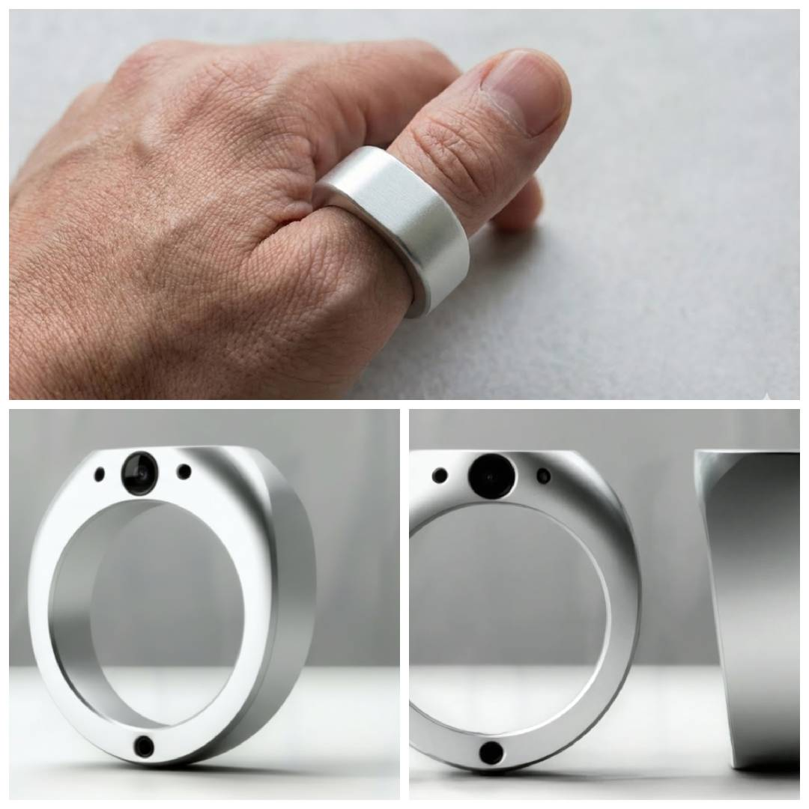
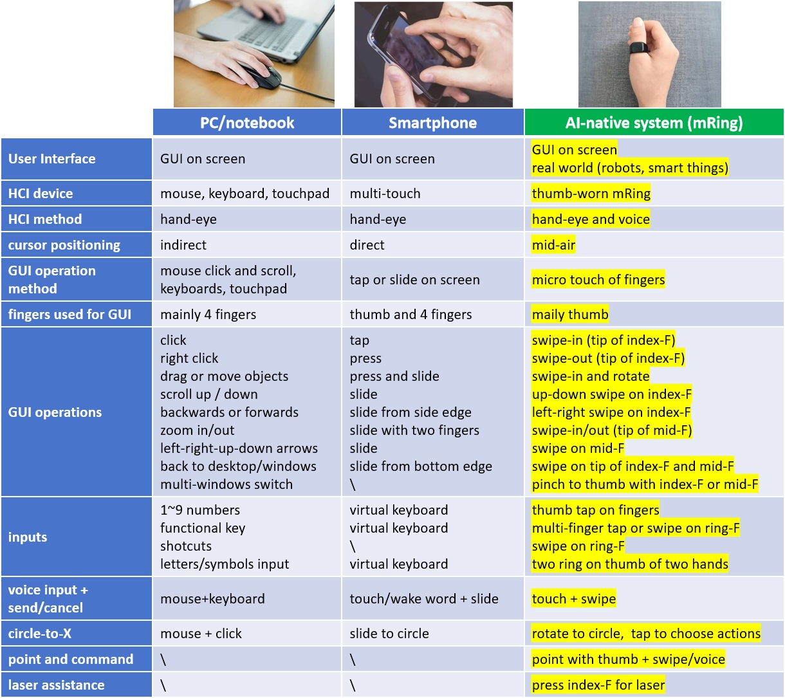
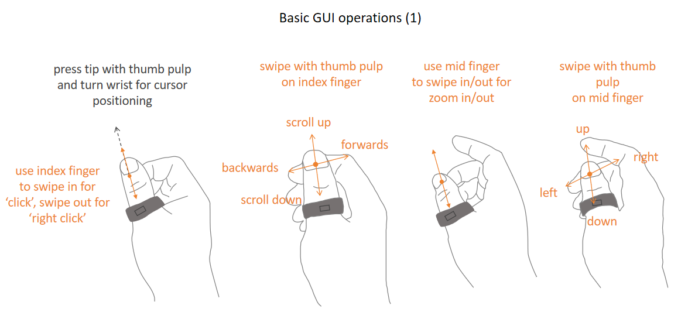
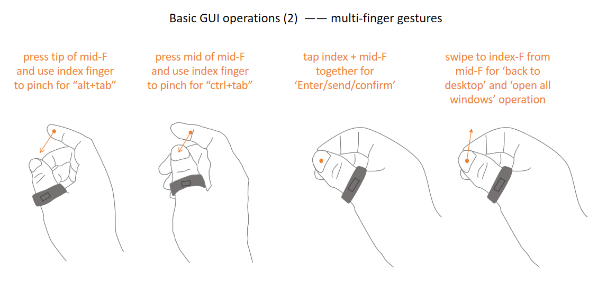
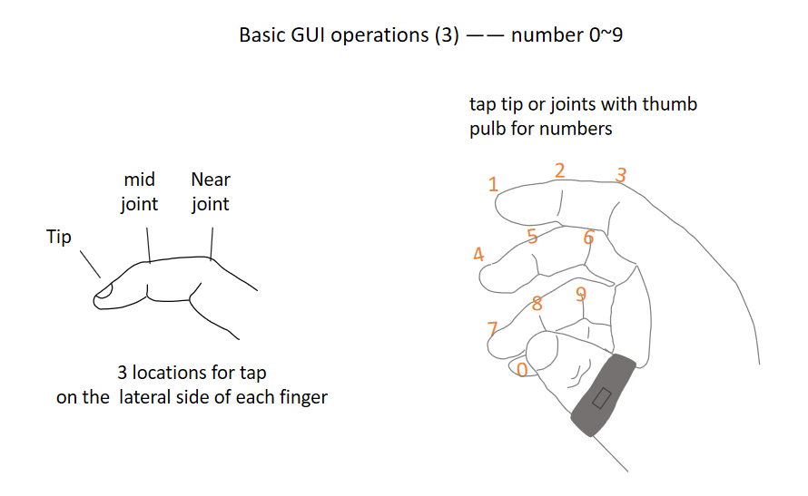

**mRing**: thumb-worn multimodal smart Ring for mid-air HCI.

mRing, a smart ring worn on the thumb, is designed to support multimodal mid-air interactions with Computers/TV/Phone/AI/Robots. It capture micro touch gestures between thumb and other four fingers and interpret them to GUI operation or inputs. Users can use it to replace mouse&keyboard or remote control, to control voice input and circle selection, and also for intuitive manipulation of robots and smart home systems.

.

The main idea is using an inner macro lens to capture micro touch gestures between thumb pulb and pulb & lateral side of other fingers, then map to operations of GUI control or key input. as below diagram:

Also it use a outer scene lens to capture display in the scene to calculate cursor location indicated by the pointing direction of the thumb. IMU is also used to assist in above calculations.

Comparison of mRing with other major platforms: PC and smartphone.

---

## 🌟 Why mRing?

### The personal motivation  
I have a 8th grade son who likes much to play PC games like HOI4/Cards and watch related videos to learn how to play. I started worrying about his wrist, posture, and long-term health.

Since AI chip and algorithms are so powerful now(I am an IC/FPGA design engineer), i thought if we can make a camera based input device to control PC in the air while standing, leaning back, or lying down.

This question led me to create **mRing**: it supports complex GUI operation and keyboard input on PC, inlcuding cursor positioning, common GUI operations, numbers/letters input, voice input control and newly popular AI enabled circle-to-X operations. 

---

## 🎯 What is mRing?

mRing combines:

- **Thumb-worn form factor**
- **inside finger camera** for finger gesture capture
- **outside scene camera** for screen positioning or real-world scene capture
- **mic input** for voice input
- **IMU** for gesture computing and awakening of the Ring
- **Laser pointer** for off-screen notification or guidance of real-world manipulation
- **6nm customized ASIC MR1** for computing of gesture and screen location
- **battery and charging point**
- **bluetooth** for connection with computing device like PC/Phone/TV

---

## 🧩 Main Features

### 1. **Thumb Gesture-based control**
Perform gestures in mid-air and mapping to GUI operation/inputs:
- mouse clicks and scroll, and basic keys input 
  
  
- other keys input and shortcut with multi finger gesture
  
  
- numbers input
  
  
- letters input with two hands
  
   
- circle selection
  

    
### 2. **Laser-guided pointing**
Point at objects, robots, or smart things with laser guidance.  
mRing captures the laser spot + context + voice and sends to Hosts/Robots to generate actions.

## 📦 Contents of This Repository

- **/videos/mRing_conceptual_overview.mp4**  
  Concept demo video of mRing operations (not hardware-accurate, but illustrates interaction flows).
  
- **/whitepapers/**  
  (To be added)Full technical whitepaper describing mRing's design philosophy, architecture, and use cases.

- **/images/**  
  Overview, Interaction diagrams, hardware block diagrams, and system-level flows.

---

### The broader vision  
mRing aims to become all-in-one input device:

- A **replacement** or alternative to the mouse&keyboard / multi-touch / remote control / laser-pen
- A **most natural** method for Voice input
- A **best method** for circle-to-X operation which is getting popular for interaction with AI
- A **magic stick** for intuitive manipulation of robots and smart home devices

---

## 🧪 Current Status

mRing is currently:

- A complete conceptual design  
- Six related patents filed  
- Looking for collaborators in:  
  - Hardware industrial design  
  - Optical/laser module engineering  
  - Robotics integration  
  - ODM/contract manufacturing

This repo is **not** a finished product — it is an open design proposal seeking contributors and partners.

---

## 🤝 Call for Collaborators

If you are passionate about:

- Post-mouse interaction  
- Wearable computing  
- Human–AI symbiosis  
- Robotics  
- New input devices  
- Chip-level low-power architecture  

You are welcome to join.

Please reach out via GitHub Issues or email:  
**[vincezhou8@gmail.com]**

---

## 📜 License

TBD depending on collaboration model (MIT/Open Hardware License/Custom).  
Initial documentation is open for feedback and non-commercial exploration.

---

## ⭐ Star This Project

If you believe the mouse will eventually be replaced, or that AI needs new human input hardware, please star the repo to support this direction.

---

## 🙏 Acknowledgments

Inspired by pioneers in human-computer interaction who pushed beyond the graphical interface era.  
mRing also aim to explore the next era: **AI-native interaction.**

