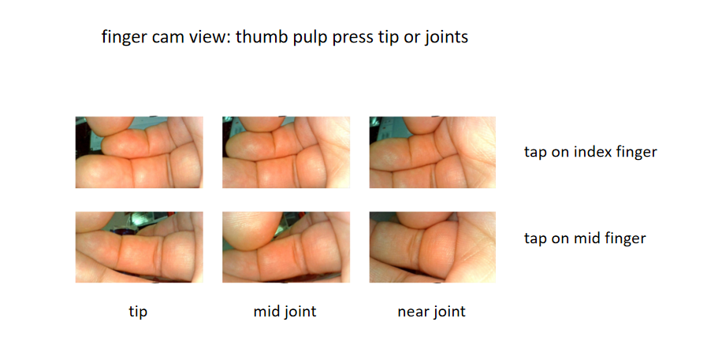
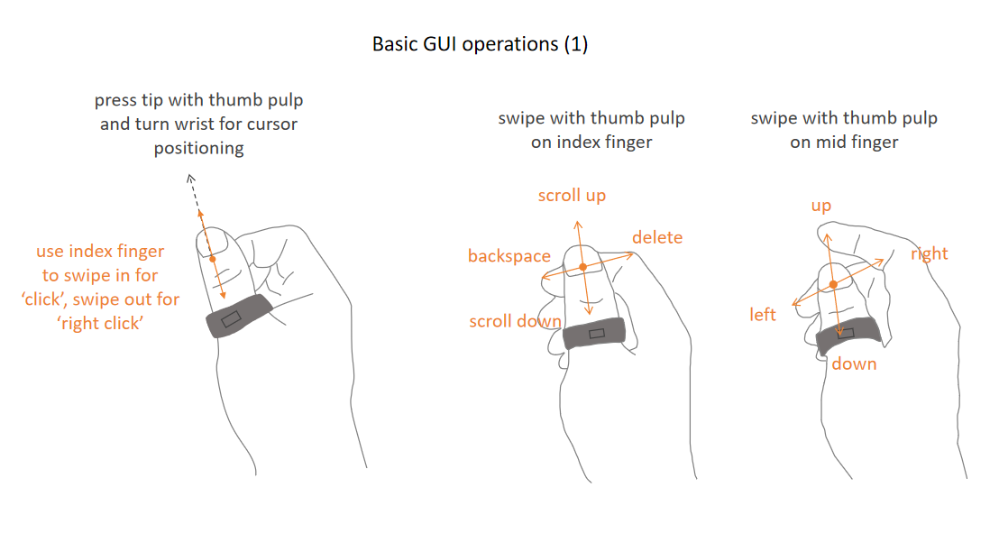
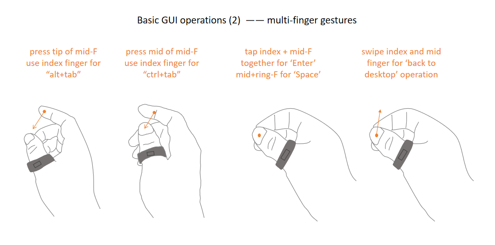
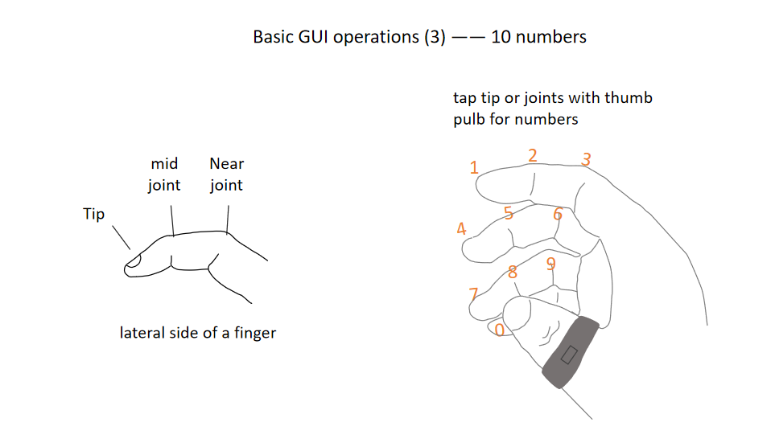
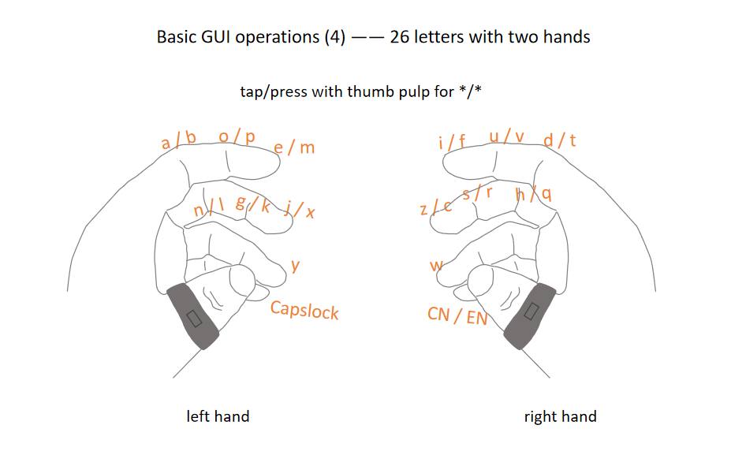
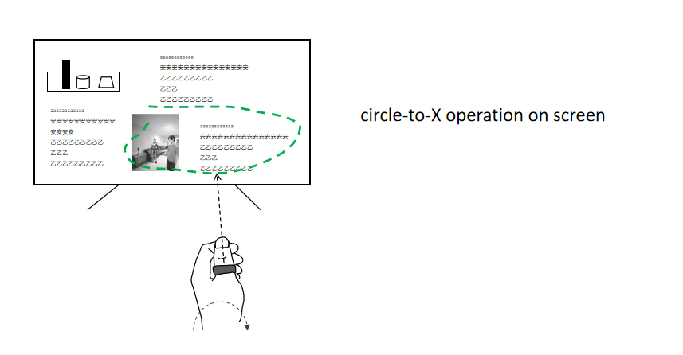

**mRing**: wearable multimodal smart Ring for HCI.

I am a 15+ years ASIC and system design engineer, and this thumb-worn smart ring, callled "mRing", is designed to support multimodal mid-air interactions with computers/TV/AI. Users can use it to replace mouse&keyboard or remote control, also use it for intuitive manipulation of robots and smart home systems.

The main idea is using a macro lens to capture actions between thumb pulb and lateral side of other fingers as gestures to control GUI or as key input, while using a outside scene cam to capture display and calculate it with thumb direction as cursor location.

---

## 🌟 Why mRing?

### The personal motivation  
My teenage son likes to sit whole day to play PC games like HOI4 and Cards or watch and learn from related videos.
Seeing him develop early symptoms of wrist stress and other issue forced me to rethink the input devices we all still rely on.

**Why are we still using mouse and keyboard — technologies invented 40 years ago — in a world with AI computing, mature voice tech and powerful agents?**
**Can we control the PC over the air while we are standing or laying down?**

This question led me to create **mRing**, an input device that support complex GUI operation and keyboard input on PC, inlcuding cursor positioning, common GUI operations, numbers/letters input and new circle-to-X operations. mRing also aligns with the next decade of AI-native interaction.

### The broader vision  
mRing aims to become all-in-one input device:

- A **replacement** or alternative to the mouse&keyboard / multi-touch / remote control / laser-pen
- A **most natural** method for Voice input
- A **best method** for circle-to-X operation which is getting popular for interaction with AI
- A **magic stick** for intuitive manipulation of robots and smart home devices 

---

## 🎯 What is mRing?

mRing combines:

- **Thumb-worn form factor**
- **inside finger camera** for finger gesture capture
- **outside scene camera** for screen positioning or real-world scene capture
- **mic input** for voice input
- **IMU** for gesture computing and awakening of the Ring
- **Laser pointer** for off-screen notification or guidance of real-world manipulation
- **6nm customized ASIC MR1** for computing of gesture and screen location
- **battery and charging point**
- **bluetooth** for connection with computing device like PC/Phone/TV

The result is a new human–machine interface that merges complete function GUI operation and real world manipulation into a single device.

---

## 🧩 Key Features

### 1. **Gesture-based control**
Perform gestures in mid-air to:
- mouse clicks and scroll, and basic keys 
  
  
- other keys and shortcut with multi finger gesture
  
  
- number input
  
  
- letters input with two hands
  
  
- circle selection
  

    
### 2. **Laser-guided pointing**
Point at objects, robots, or smart things with laser guidance.  
mRing captures the laser spot + context + voice and sends to Hosts/Robots to generate actions.

## 📦 Contents of This Repository

- **/whitepapers/**  
  Full technical whitepaper describing mRing's design philosophy, architecture, and use cases.

- **/images/**  
  Overview, Interaction diagrams, hardware block diagrams, and system-level flows.

- **/videos/mRing-operation-concept.mp4**  
  Concept demo video (not hardware-accurate, but illustrates interaction flows). 

---

## 🧪 Current Status

mRing is currently:

- A complete conceptual design  
- Six related patents filed  
- Looking for collaborators in:  
  - Hardware industrial design  
  - Optical/laser module engineering  
  - Robotics integration  
  - ODM/contract manufacturing

This repo is **not** a finished product — it is an open design proposal seeking contributors and partners.

---

## 🤝 Call for Collaborators

If you are passionate about:

- Post-mouse interaction  
- Wearable computing  
- Human–AI symbiosis  
- Robotics  
- New input devices  
- Chip-level low-power architecture  

You are welcome to join.

Please reach out via GitHub Issues or email:  
**[vincezhou8@gmail.com]**

---

## 📜 License

TBD depending on collaboration model (MIT/Open Hardware License/Custom).  
Initial documentation is open for feedback and non-commercial exploration.

---

## ⭐ Star This Project

If you believe the mouse will eventually be replaced, or that AI needs new human input hardware, please star the repo to support this direction.

---

## 🙏 Acknowledgments

Inspired by pioneers in human-computer interaction who pushed beyond the graphical interface era.  
mRing also aim to explore the next era: **AI-native interaction.**

